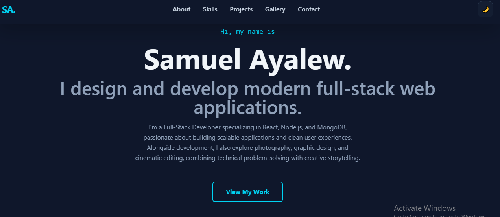
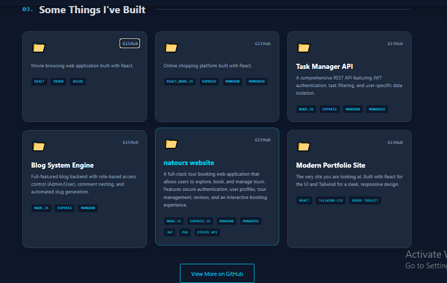
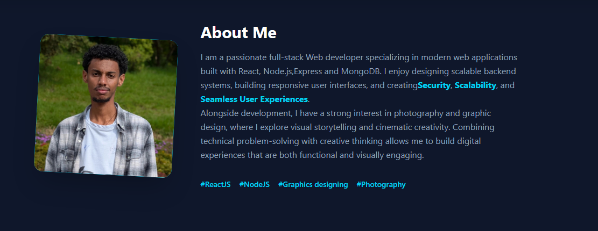

# Personal Portfolio Website

A modern and responsive portfolio website built to showcase my projects, technical skills, and professional journey as a Software Engineer and Cybersecurity Enthusiast.

## 📸 Website Preview

### Home Page



### Projects Section



### About Section



---

## 🚀 Features

- Responsive design for desktop, tablet, and mobile devices
- Modern and clean user interface
- Project showcase section with GitHub links and live demos
- Skills and technologies section
- About Me section
- Contact information and social links
- Smooth animations and interactive components

## 🛠️ Built With

- React.js
- JavaScript (ES6+)
- HTML5
- CSS3
- Tailwind CSS
- Vite

## 📂 Featured Projects

### 🌍 Natours Website

A full-stack tour booking platform that allows users to browse, book, and manage tours. It includes secure authentication, user management, and payment integration.

**Technologies:** Node.js, Express.js, MongoDB, JWT, Stripe API

### 🛒 E-Commerce Website

A modern e-commerce platform featuring product browsing, shopping cart functionality, user authentication, and a responsive user interface.

**Technologies:** React.js, Node.js, Express.js, MongoDB, JWT

### 🎬 Setflix

A Netflix-inspired movie streaming application that allows users to browse movies and TV shows with a beautiful and responsive interface.

**Technologies:** React.js, JavaScript, API Integration, Tailwind CSS

### 🔐 Authentication System

An authentication boilerplate implementing secure password hashing using Bcrypt and stateless authentication with JWT and refresh tokens.

**Technologies:** Node.js, Express.js, Bcrypt, JWT

## 🖥️ Installation

1. Clone the repository:

```bash
git clone https://github.com/sami1921/portfolio-website.git
```

2. Navigate to the project directory:

```bash
cd portfolio-website
```

3. Install dependencies:

```bash
npm install
```

4. Start the development server:

```bash
npm run dev
```

## 📦 Build for Production

```bash
npm run build
```

## 📧 Contact

- GitHub: https://github.com/sami1921
- LinkedIn: https://linkedin.com/in/samuel-ayalew-8172866373
- Email: [samiayalew26@gmail.com](mailto:samiayalew26@gmail.com)

## 📄 License

This project is licensed under the MIT License.

---

⭐ If you like this project, consider giving it a star on GitHub!
